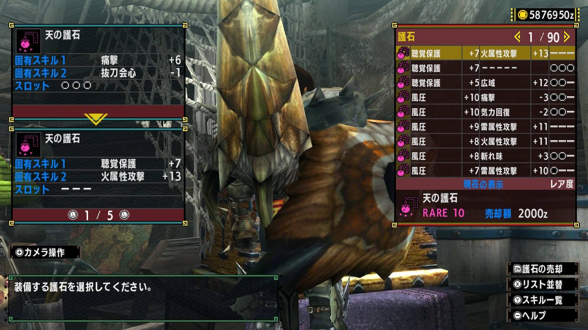

# CharmRecog-MHXX 
「モンスターハンターXX」の護石を画像から読み取り,スキルシミュ（泣）で使用できるcsvを作成するプログラムです。
Nintendo Switch版のみで動作確認をしています。

# データの準備
0. アイテムボックス>装備の変更・売却>装飾品の着脱 に移動し,Yボタンを押してすべての装飾品を解除しておくことをオススメします。
    - 空きスロの画面を利用してスロット数を計算しているので,スロット数がうまく読み込めない可能性があります。
1. アイテムボックス>装備の変更・売却>護石の選択 に移動します。
2. 読み取りたい護石のページをスクショします。
    - 以下のようなスクショが取れていればOKです。
     

3. そのスクショを`data/input`にコピーします。
    - スマホに転送→パソコンに移動 がいいと思います。
    - 動作確認用に`data/input`には私のゴ○お守りのスクショが保存されているので削除してからコピーしてください。

# 読み取りの実行
読み取りを実行する場合は,以下を実行するだけでOKです。

```
cd script
./run.sh
```
プログラムが終了すると,`out/**/goseki.csv`が出力されます。これを（泣）シミュに入れることで護石一覧をまとめて登録することができます。

# 確認されている問題まとめ
これらの問題を直すかは気分とやる気次第です。

- 一部スキルが読み取りミスを起こす場合があります。一部読み取れている場合にスキル名を修正できるように,スキルの中から一番近い文字列を検索して修正する機能がついています。
    - そのため,類似した読み取りミスがそのまま反映されてしまう場合があります。
    - 確認された例（修正前）
        - 龍気→本気 と誤読
- 一部スキルがうまく読み取れなさすぎるのもあります。これは文字認識するモデルをモンハン用に学習し直す必要があるのでたぶん治らないと思いますorz
    - 采配 が読み取れない （t と誤読）

上記のように読み取り間違いがある可能性がそれなりにありますので,ご利用の際には読み取りミスが無いか確認していただければと思います。

# 関連リンク
- EasyOCR
    - https://github.com/JaidedAI/EasyOCR.git

- MHXX スキルシミュ(泣)
    - https://mhxx.wiki-db.com/sim/
